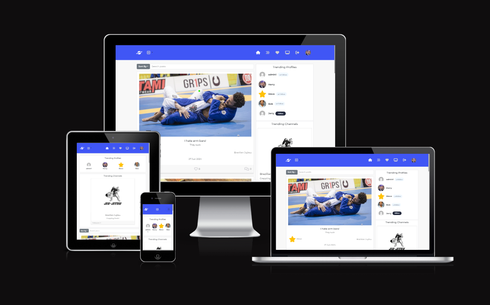

# Threadly

Threadly is an innovative content-sharing platform designed to bring users together through various niche channels. This project focuses on creating an engaging, interactive environment where users can share, discover, and discuss a wide range of content. By enabling features such as user profiles, channels, posts, comments, likes, and votes, Threadly aims to foster a vibrant community of content enthusiasts.

The development of Threadly follows agile methodologies, ensuring continuous improvement and adaptation based on user feedback and evolving needs. With a user-friendly design, robust security measures, and plans for future enhancements, Threadly is set to provide an exceptional user experience.

For more technical details and to explore the backend implementation, you can visit the API repository [here](https://github.com/Bluiss/PP5-API-Community-forum).

Site - https://pp5-react-community-forum-eca09c2c9ca6.herokuapp.com/

## Project Goals

Threadly is designed to be a content-sharing platform where users can interact with a multitude of content from various niche channels. The primary goals of Threadly include:

- **User Engagement**: Create a dynamic and interactive environment that encourages users to engage with content, follow channels, and participate in discussions.
- **Diverse Content Sharing**: Support a wide range of content types, allowing users to share text, images, videos, and links to enrich the community experience.
- **Community Building**: Foster a sense of community by enabling users to create and follow channels based on their interests, and by providing features like comments, likes, and votes to facilitate interaction.
- **Personalization**: Offer personalized experiences by allowing users to customize their profiles, follow specific channels, and receive updates on content that matters to them.
- **Scalability**: Build a platform that can scale to accommodate a growing user base and an increasing volume of content, ensuring performance remains robust and reliable.
- **User-Friendly Design**: Implement an intuitive and responsive design that works seamlessly across various devices, ensuring accessibility for all users.
- **Security and Privacy**: Prioritize user security and privacy by implementing robust authentication measures, secure data handling practices, and clear privacy policies.
- **Continuous Improvement**: Adopt an agile development methodology to continuously improve the platform based on user feedback, technological advancements, and evolving user needs.

Threadly aims to become a go-to platform for content enthusiasts, offering a space where they can discover, share, and discuss content within their areas of interest.

# Table of Contents
- [Threadly](#threadly)
  - [Project goals](#project-goals)
  - [Table of contents](#table-of-contents)
  - [User Stories](#user-stories)
    - [User](#user)
    - [Profile](#profile)
    - [Channel](#channel)
    - [ChannelFollower](#channelfollower)
    - [Post](#post)
    - [Comment](#comment)
    - [Follower](#follower)
    - [Like](#like)
    - [Vote](#vote)
  - [Themes](#themes)
    - [User Management](#user-management)
    - [Profile Management](#profile-management)
    - [Channel Interaction](#channel-interaction)
    - [Content Sharing](#content-sharing)
    - [Community Interaction](#community-interaction)
    - [Social Features](#social-features)
    - [Engagement and Feedback](#engagement-and-feedback)
  - [Agile development methodology](#agile-development-methodology)
    - [Threadly Agile Development Process](#threadly-agile-development-process)
  - [Planning](#planning)
    - [Mockups](#mockups)
    - [Data models](#data-models)
  - [Design](#design)
    - [Colours](#colours)
    - [Fonts](#fonts)
  - [Features](#features)
    - [CRUD functionality](#crud-functionality)
      - [Account Management](#account-management)
      - [Channel Management](#channel-management)
      - [Profile Management](#profile-management)
      - [Likes](#likes)
      - [Comments](#comments)
      - [Votes](#votes)
    - [Future improvements and features](#future-improvements-and-features)
  - [Frameworks, libraries and dependencies](#frameworks-libraries-and-dependencies)
    - [React-Router-DOM](#react-router-dom)
    - [ReactDOM](#reactdom)
    - [Axios](#axios)
    - [JWT Decode](#jwt-decode)
    - [Bootstrap](#bootstrap)
    - [Tooltip](#tooltip)
  - [React features used to enhance user experience](#react-features-used-to-enhance-user-experience)
    - [Custom hooks](#custom-hooks)
      - [useClickOutsideToggle](#useclickoutsidetoggle)
      - [useRedirect](#useredirect)
  - [Testing](#testing)
    - [Manual testing](#manual-testing)
    - [Automated tests](#automated-tests)
    - [Validator testing](#validator-testing)
    - [W3C CSS validator](#w3c-css-validator)
    - [ESLint JavaScript validator](#eslint-javascript-validator)
    - [Lighthouse testing](#lighthouse-testing)
    - [Resolved bugs](#resolved-bugs)
    - [Unresolved bugs](#unresolved-bugs)
  - [Deployment](#deployment)
  - [Credits](#credits)

## User Stories

### User Stories

#### User

- **As a user,** I want to create an account so that I can log in and access the platform.
- **As a user,** I want to log in to my account so that I can access my personalized content and interact with the community.
- **As a user,** I want to update my account details so that I can keep my profile information current.

#### Profile

- **As a user,** I want to create a profile so that I can share information about myself with the community.
- **As a user,** I want to view my profile so that I can see the information I have shared.
- **As a user,** I want to edit my profile so that I can update my personal information and preferences.

#### Channel

- **As a user,** I want to create a channel so that I can start a new topic of discussion.
- **As a user,** I want to view a list of channels so that I can find topics that interest me.
- **As a user,** I want to follow a channel so that I can stay updated on new posts within that channel.
- **As a user,** I want to edit a channel I own so that I can update its information and settings.

#### ChannelFollower

- **As a user,** I want to follow a channel so that I receive updates on new posts and activity within the channel.
- **As a user,** I want to view the channels I follow so that I can easily access my favorite content.

#### Post

- **As a user,** I want to create a post so that I can share content with the community.
- **As a user,** I want to view a post so that I can read its content and comments.
- **As a user,** I want to edit a post I created so that I can update or correct its content.
- **As a user,** I want to delete a post I created so that I can remove content that is no longer relevant or appropriate.

#### Comment

- **As a user,** I want to comment on a post so that I can participate in the discussion.
- **As a user,** I want to edit a comment I made so that I can update or correct my input.
- **As a user,** I want to delete a comment I made so that I can remove input that is no longer relevant or appropriate.

#### Follower

- **As a user,** I want to follow other users so that I can see their posts and activity.
- **As a user,** I want to view the users I follow so that I can easily access their profiles and posts.

#### Like

- **As a user,** I want to like a post so that I can show my appreciation for the content.
- **As a user,** I want to view the posts I have liked so that I can revisit content that I enjoyed.

#### Vote

- **As a user,** I want to upvote a post so that I can show support for high-quality content.
- **As a user,** I want to downvote a post so that I can express disapproval of low-quality content.
- **As a user,** I want to see the vote count on a post so that I can gauge the community's opinion of the content.

## Themes

### User Management

- **Account Creation and Management**
  - Enables the creation and management of user accounts, including registration, login, and updating account details.

### Profile Management

- **Profile Creation and Editing**
  - Facilitates the creation, viewing, and editing of user profiles to share personal information with the community.

### Channel Interaction

- **Channel Creation and Following**
  - Supports the creation of channels for discussion topics, viewing a list of channels, following channels to stay updated, and editing channel details.

### Content Sharing

- **Post Creation and Management**
  - Allows the creation, viewing, editing, and deletion of posts to share content with the community.

### Community Interaction

- **Commenting and Feedback**
  - Provides functionality for commenting on posts, editing comments, and deleting comments to participate in discussions.

### Social Features

- **Following Users and Content**
  - Includes features for following other users and channels, viewing followed users and channels, and staying updated on their activity.

### Engagement and Feedback

- **Likes and Votes**
  - Implements liking posts to show appreciation, viewing liked posts, upvoting and downvoting posts to express opinions, and seeing the community's feedback on posts.

## Agile development methodology

### Threadly Agile Development Process

GitHub issues and projects were used to document and track an agile development approach for Threadly. A GitHub issue was created for each user story. A GitHub milestone was created to represent the product backlog, where all user stories were initially added.

Development work was scheduled using a series of iterations, each with a timebox of around 2 weeks.
User stories were moved from the product backlog into the relevant iteration as each cycle of work began.

A project Kanban board was used to track progress, with user stories moved between 'Todo', 'In Progress', and 'Done' columns as appropriate.

The project board can be found in the DRF API Repo -

## Planning

### Mockups

Figma was utilized to design the mockup wireframes for Threadly. These mockups provide a visual representation of the platform's user interface and layout. You can view the Figma files here: [Figma Files](https://www.figma.com/design/bViM8YceKmq6FSrMfEC0bP/PP5---Community-forum?node-id=0-1&t=I1nKotAgNEHeaB44-1).

### Data models

The data models for Threadly were meticulously planned and are available in the DRF API repository. These models define the structure of the database and the relationships between different entities within the platform. You can see the data models here: [Data models in DRF API](https://github.com/Bluiss/PP5-API-Community-forum).

## Design

### Colours

A cohesive color scheme was chosen to enhance the visual appeal and usability of the platform. A simple blue was used as the primary color for headers, providing a clean and professional look. Accents of black and white were incorporated throughout the website to maintain a simple yet elegant design. This color palette ensures a consistent and visually pleasing user experience.

### Fonts

The Montserrat font was used throughout the project to maintain a modern and readable aesthetic. This font was selected for its clean lines and versatility, contributing to the overall user-friendly design of the platform.

## Features

### CRUD functionality

#### Account Management

Threadly provides comprehensive account management features that allow users to fully control their account and content.

- **Add Post**: Users can create new posts to share content with the community. [Link](src/assets/readme_images/addpost.png)
- **Edit Post**: Users can edit their existing posts to update or correct content. [Link](src/assets/readme_images/postedit.png)
- **Delete Post**: Users can delete their posts if they are no longer relevant or appropriate. [Link](src/assets/readme_images/postdelete.png)

#### Channel Management

Users can manage channels to curate and organize content around specific topics or interests.

- **Add Channel**: Users can create new channels to start discussions on new topics. [Link](src/assets/readme_images/addchannel.png)
- **Edit Channel**: Users can edit channels they own to update information and settings. [Link ](src/assets/readme_images/editchanne;.png)
- **Delete Channel**: Users can delete channels they own if they are no longer needed. [Link ](src/assets/readme_images/channeldelete.png)

#### Profile Management

Threadly allows users to manage their profiles to personalize their experience and share information about themselves.

- **Add Profile**: Users can create a profile when they join Threadly to share information with the community. [Link](src/assets/readme_images/signup.png)
- **Edit Profile**: Users can edit their profile to update personal information and preferences. [Link](src/assets/readme_images/profileedit.png)

#### Likes

Engagement with content is facilitated through the liking system.

- **Like Post**: Users can like posts to show appreciation for the content. [Link](src/assets/readme_images/liked.png)

#### Comments

Threadly encourages interaction through comments.

- **Comment**: Users can comment on posts to participate in discussions. [Link](src/assets/readme_images/comment.png)

#### Votes

Users can express their opinions on content through a voting system.

- **Voting**: Users can upvote or downvote posts to show support for high-quality content. [Link](src/assets/readme_images/votes.png)

#### Trending Channels

Threadly highlights trending channels to help users discover popular topics and engage with active discussions.

- **View Trending Channels**: Users can browse a list of currently trending channels. [Link](src/assets/readme_images/trendingchannels.png)

#### Trending Profiles

Threadly features trending profiles to showcase active and popular community members.

- **View Trending Profiles**: Users can explore a list of trending profiles to find influential users and follow their content. [Link](src/assets/readme_images/TrendingProfiles.png)

#### Top Posters

Threadly recognizes top posters to encourage content creation and community engagement.

- **View Top Posters**: Users can see a list of users with the highest number of posts. This highlights active contributors within the community. [Link](src/assets/readme_images/topposters.png)

## Future improvements and features

Threadly aims to continuously evolve and improve to meet user needs and enhance the overall experience. Here are some planned future improvements and features:

- **Admin Panel**: A comprehensive admin panel to manage users, content, and site settings efficiently. This panel will provide tools for moderation, user management, and analytics.

- **Spam Control**: Implementation of advanced spam detection and control mechanisms to keep the platform clean and free from unwanted content. This includes automated filters and manual reporting systems.

- **Direct Message Service**: Introducing a direct messaging feature to allow users to communicate privately with each other. This will include real-time chat, notifications, and message management.

- **Enhanced Notification System**: Expanding the notification system to provide users with real-time updates about activities related to their posts, comments, and followed channels.

- **Advanced Search Functionality**: Improving the search functionality to allow users to find content more easily. This will include filters, search suggestions, and more relevant search results.

- **Mobile App**: Developing a mobile application to provide a seamless Threadly experience on mobile devices. This app will include all the core features of the platform with an optimized user interface for mobile use.

- **Integration with Other Platforms**: Adding integration with other social media and content platforms to allow users to share Threadly content across different networks easily.

- **User Customization Options**: Providing more options for users to customize their profiles and channel appearances, including themes, layouts, and custom avatars.

- **Community Events and Challenges**: Introducing community events and challenges to encourage user engagement and interaction. These events could include content creation contests, topic discussions, and more.

## Frameworks, libraries and dependencies

### React-Router-DOM

**react-router-dom** - This library enables 'client side routing' for React web applications and is used to implement basic routing in Threadly, i.e., to implement the links on the bottom navbar, and register, sign-in, and sign-out links. Using React-Router-DOM also enabled the implementation of 'single page mode' to enhance the experience for users on larger screens. The `useSinglePage` custom hook is referenced in App.js, with different Route components conditionally rendered for the various paths depending on whether the app is running in single page mode. The `useLocation` hook from React-Router-DOM is used in some components to determine the current URL and respond accordingly, for example, by ensuring the correct nav button is highlighted in the bottom navbar for mobile users.

### ReactDOM

**react-dom** - react-dom is used to manipulate the DOM outside of a specific component and supports the user experience by enabling modal dialogs to be appended to the top level of the DOM (important for accessibility) and alerts to be appended to specific components. For example, notifications are fetched by the NotificationsMenu component, but this takes the form of a dropdown menu, so using ReactDOM allows the component to 'reach out' into the DOM and display error alerts in a more obvious location than inside the dropdown.

### Axios

**Axios** - The axios library was chosen to simplify making HTTP requests to the REST API (e.g., not having to manually configure HTTP headers), and because it enables simple implementation of 'interceptors' which are used to request a refresh token in the event of an HTTP 401 error. This enhances the user experience because an authenticated user remains signed in for up to 24 hours, rather than having to sign in again after five minutes.

### JWT Decode

**jwt-decode** - Used to decode Base64URL encoded JSON web tokens.

### Bootstrap

**Bootstrap** - A popular front-end framework for developing responsive and mobile-first websites. It provides a collection of CSS and JavaScript tools for creating a consistent and functional user interface.

### Tooltip

**react-tooltip** - A flexible and lightweight library used to create tooltips in React applications, enhancing user experience by providing additional information on hover.

# React features used to enhance user experience

## Custom Hooks

### useClickOutsideToggle

The `useClickOutsideToggle` hook manages the state of an expandable element, such as a dropdown or modal. It toggles the element's expanded state and collapses it when a click is detected outside of the element.

### useRedirect

The `useRedirect` hook handles user redirection based on their authentication status. It attempts to refresh the authentication token on mount and redirects users accordingly, either to the home page if logged in or to the sign-in page if logged out.

## Reusable Components
### Asset

The `Asset` component is designed to display a spinner, an image, or a message. This component is useful for indicating loading states or displaying static content.

### Avatar

The `Avatar` component displays a user's profile image along with optional text. It is typically used in user profile previews and comments.

### MoreDropdown

The `MoreDropdown` component provides a dropdown menu with options to edit or delete an item. It uses the `Dropdown` component from `react-bootstrap`.

### ProfileEditDropdown

The `ProfileEditDropdown` component provides a dropdown menu with options to edit the profile, change the username, or update the password.

### ChannelEditDropdown

The `ChannelEditDropdown` component provides a dropdown menu with an option to edit a channel.

### NavBar

The `NavBar` component is the main navigation bar of the application. It includes links to various sections of the site and dynamically displays options based on the user's authentication status.

### SearchBar

The `SearchBar` component is a container for the search functionality, integrated within the application layout for users to search content.

### TitleComponent

The `TitleComponent` fetches and displays the title of a page or channel based on the URL parameters. It also sets the document title dynamically.

### TopPosters

The `TopPosters` component displays a list of users with the most posts, including their usernames and post counts.

### useClickOutsideToggle

This custom hook manages the state of an expandable element (e.g., a dropdown menu) and automatically collapses it when a click is detected outside the element.

### useRedirect

This custom hook handles user redirection based on their authentication status. It attempts to refresh the authentication token and redirects users accordingly.

## Testing

### Manual testing

Manual testing was conducted to ensure that all functionalities work as expected. Each feature was tested by simulating user interactions to identify any issues or bugs. Detailed results and procedures can be found in the [Testing Doc](testing.md).

### Validator testing

To ensure the quality and standards compliance of the code, various validation tools were used:

#### W3C CSS Validator

The W3C CSS Validator was used to validate the CSS files. This tool checks for any errors or warnings in the CSS code to ensure it adheres to W3C standards. 
[Example Image](src/assets/readme_images/cssvalid.png)

#### ESLint JavaScript Validator

ESLint was used to analyze the JavaScript code. It helps in identifying and fixing problems in the code, ensuring it follows best practices and coding standards.
[Example Image](src/assets/readme_images/jslintPass.png)

#### Lighthouse Testing

Lighthouse, an open-source tool from Google, was used to audit the performance, accessibility, best practices, and SEO of the web pages. The results help in optimizing the website to provide a better user experience.
[Example Image](link-to-image)

### Unresolved bugs

### Vote 
For a vote to be filtered it needs an inital vote

## Deployment

To deploy to Heroku, follow these steps:

- Fork or clone this repository in GitHub.
- If you have also cloned and deployed your own version of the TribeHub Django Rest Framework API, you will need to ensure the value of `axios.defaults.baseURL` in `src/api/axiosDefaults.js` is set to the base URL for your API. Pull to your local development environment and push back to GitHub if necessary; otherwise, leave as is to use the original TribeHub API.
- Log in to Heroku.
- Select 'Create new app' from the 'New' menu at the top right.
- Enter a name for the app and select the appropriate region.
- Select 'Create app'.
- Select the 'Deploy' tab at the top.
- Select 'GitHub' from the deployment method options to confirm you wish to deploy using GitHub. You may be asked to enter your GitHub password.
- Find the 'Connect to GitHub' section and use the search box to locate your repo.
- Select 'Connect' when found.
- Optionally choose the main branch under 'Automatic Deploys' and select 'Enable Automatic Deploys' if you wish your deployed site to be automatically redeployed every time you push changes to GitHub.
- Find the 'Manual Deploy' section, choose 'main' as the branch to deploy and select 'Deploy Branch'.

When deployment is complete, you will be given a link to the deployed site.

## Credits

The coding institue moments react app was used as influence and a base
